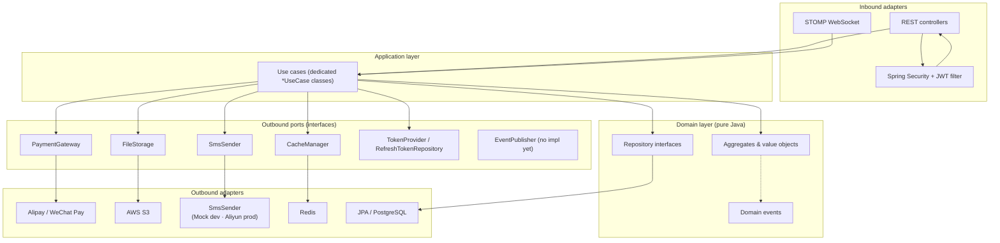

# NeoPick — Architecture Overview

A two-sided marketplace backend connecting guitar students with private teachers
(search, book, pay, review, chat). This document describes how the code is organized
and why. It is a personal project, not a production system — several pieces are
intentionally stubbed (see [Known gaps](#known-gaps)).

---

## 1. Architecture style

The codebase follows **Hexagonal Architecture (Ports & Adapters)** with a
domain-centric layout. The core rule is dependency direction:

```text
adapter (inbound)  →  application (use cases)  →  domain (pure)
                                │
                                ▼
                       port (outbound interfaces)
                                │
                                ▼
                       adapter (outbound implementations)
```

- The **domain** layer has **zero framework imports** (no Spring, no JPA, no AWS) — it
  depends only on the JDK and on itself. This is enforced by convention; a grep for
  `org.springframework`, `jakarta`, or `com.neopick.adapter` in `domain/` returns nothing.
- The **application** layer holds one use-case class per action. It depends on the domain
  and on outbound **ports** (interfaces), never on concrete adapters.
- The **adapter** layer contains everything framework-specific: Spring MVC controllers,
  JPA persistence, Redis, SMS, AWS S3, payment gateways, WebSocket, and schedulers.
- The **port** package holds the outbound interfaces that the domain/application layer
  programs against.

---

## 2. Package / module map

Single-module Maven project (`pom.xml`), Java 21, Spring Boot 3.3.5.

```text
src/main/java/com/neopick/
├── NeopickApplication.java
│
├── domain/                  ← pure domain model (zero framework imports)
│   ├── user/                ← User, UserId, PhoneNumber, UserRole, UserStatus, UserRepository
│   ├── teacher/             ← Teacher, TeacherId, City, TeacherLevel/Status,
│   │                          TeacherRepository, TeacherSearchCriteria
│   ├── booking/             ← Booking aggregate, BookingStatus, Address,
│   │                          BookingRepository, booking events & exceptions
│   ├── payment/             ← Payment, PaymentId, PaymentMethod/Status,
│   │                          PaymentRepository, payment events
│   ├── review/              ← Review, ReviewId, ReviewRepository, review events
│   ├── favorite/            ← Favorite, FavoriteRepository
│   ├── message/             ← Conversation, ChatMessage, MessageType, ConversationRepository
│   ├── notification/        ← Notification, NotificationType, NotificationRepository
│   ├── auth/                ← SmsCodeService, TokenPair, StoredRefreshToken, AuthService
│   ├── media/               ← MediaType + file validation exceptions
│   └── common/              ← AggregateRoot, ValueObject, DomainEvent, Money,
│                              BusinessException
│
├── application/             ← 23 *UseCase classes (commands/results as records)
│   ├── auth/                ← SendSmsCode, Login, RefreshToken
│   ├── booking/             ← Submit, Manage, GetStudent/TeacherBookings
│   ├── payment/             ← InitiatePayment, HandlePaymentCallback
│   ├── teacher/             ← Search, Detail, Featured, Popular, WeeklyRecommendations
│   ├── city/ home/ user/ review/ favorite/ message/ notification/
│   └── service/             ← FileValidationService
│
├── port/                    ← outbound interfaces (9 interfaces + 1 record)
│   ├── payment/             ← PaymentGateway
│   ├── storage/             ← FileStorage, PresignedUrlResult
│   ├── sms/                 ← SmsSender
│   ├── cache/               ← CacheManager
│   ├── security/            ← TokenProvider, RefreshTokenRepository, SecurityContext
│   └── messaging/           ← EventPublisher, WebSocketSessionManager   (see gaps)
│
├── adapter/                 ← framework-specific implementations
│   ├── web/                 ← 13 REST controllers, DTOs, GlobalExceptionHandler,
│   │                          JWT filter/token provider, WebSocket (STOMP)
│   ├── persistence/         ← JPA entities, Spring Data repositories,
│   │                          repository adapters, TeacherSpecification
│   ├── infrastructure/      ← AlipayPaymentGateway, WechatPaymentGateway,
│   │                          S3FileStorage, signature utils
│   ├── cache/               ← RedisCacheManager
│   ├── sms/                 ← MockSmsSender, AliyunSmsSender, SmsCodeServiceImpl
│   └── scheduled/           ← BookingExpiryScheduler, PaymentReconciliationScheduler
│
├── infrastructure/          ← cross-cutting configuration & plumbing
│   ├── config/              ← NeopickProperties, Redis, Cache, Resilience4j,
│   │                          S3, Alipay, WeChat, Jackson, Metrics, Scheduler
│   ├── ratelimit/           ← @RateLimit, RateLimitAspect, exception
│   ├── logging/             ← AccessLogFilter (+ logback-spring.xml)
│   ├── metrics/             ← BusinessMetrics, CacheMetrics, CircuitBreakerMetrics
│   └── security/            ← SecurityEventLogger
│
└── shared/                  ← Result monad, Constants
```

---

## 3. High-level diagram



Notes on the diagram:

- `EventPublisher` is declared as a port but has **no adapter implementation** — it is a
  placeholder for future SNS/SQS messaging. Nothing in the application layer calls it yet.
- `WebSocketSessionManager` is likewise declared but unimplemented; session tracking today
  lives inside `WebSocketEventListener` directly.

---

## 4. Layer responsibilities

### Domain (`domain/`)

- **Aggregates** implement `AggregateRoot` and own their invariants. The best example is
  `Booking`, whose state machine lives entirely in the aggregate (`confirm()`, `reject()`,
  `pay()`, `complete()`, `cancel()`), each guarded by `assertStatus(...)` and throwing
  `InvalidBookingTransitionException` on illegal transitions.
- **Value objects** (e.g. `Money`, `Address`, `PhoneNumber`, and typed IDs like `UserId`,
  `BookingId`) encapsulate validation and formatting instead of raw primitives.
- **Repository interfaces** (`UserRepository`, `BookingRepository`, …) define persistence
  contracts; JPA adapters implement them.
- **Domain events** (`DomainEvent` and subclasses under `*/event`) are produced by the
  domain; today they are defined but not yet consumed by an outbox or messaging pipeline.

### Application (`application/`)

- Dedicated use-case classes (23 `*UseCase` classes), e.g. `LoginUseCase`,
  `SubmitBookingUseCase`, `HandlePaymentCallbackUseCase`. Most expose a single
  `execute(...)` method; a few group the closely related actions of one aggregate
  (`ManageBookingUseCase` covers confirm/reject/cancel/complete, `MessageUseCase` covers
  list/send/mark-read).
- Commands and results are Java **records** (e.g. `LoginUseCase.LoginCommand`,
  `SubmitBookingUseCase.SubmitBookingCommand`).
- Use cases are `@Service`-annotated Spring beans and orchestrate domain aggregates via
  ports. Transaction boundaries (`@Transactional`) live here, at the use-case level, not
  in the domain.

### Ports (`port/`)

Nine outbound interfaces plus one result record:

| Port | Implemented by | Notes |
|------|----------------|-------|
| `PaymentGateway` | `AlipayPaymentGateway` (`@Primary`), `WechatPaymentGateway` | Strategy resolved by `supportedMethod()` |
| `FileStorage` | `S3FileStorage` | presigned upload/download |
| `SmsSender` | `MockSmsSender` (dev/test/local), `AliyunSmsSender` (prod) | profile-scoped |
| `CacheManager` | `RedisCacheManager` | thin wrapper over Redis |
| `TokenProvider` | `JwtTokenProvider` | JWT sign/validate |
| `RefreshTokenRepository` | `RefreshTokenRepositoryAdapter` | rotation + reuse detection |
| `SecurityContext` | `SecurityContextHolder` (adapter) | current-user access |
| `EventPublisher` | — | **no implementation** |
| `WebSocketSessionManager` | — | **no implementation** |

### Adapter (`adapter/`)

- **web** — REST controllers (thin: validate input, map DTOs, delegate to a use case),
  a `GlobalExceptionHandler` for consistent error responses, and the JWT security filter.
- **persistence** — JPA entities (`*JpaEntity`), Spring Data repositories
  (`*JpaRepository`), and `*RepositoryImpl` classes that adapt JPA to the domain
  repository interfaces. `TeacherSpecification` builds JPA Criteria queries for search.
- **infrastructure** — the real external gateways: Alipay (RSA2), WeChat Pay V3, and
  S3 file storage.
- **scheduled** — background jobs (see [schedulers](#schedulers)).

### Infrastructure (`infrastructure/`)

Cross-cutting config and observability plumbing — not business logic: `NeopickProperties`
(typed config binding), Redis/Cache/Resilience4j/S3 setup, the `@RateLimit` AOP aspect,
structured logging, and Micrometer/Prometheus metric registries.

---

## 5. Key design decisions

1. **Hexagonal over a simple 3-tier layering.** The domain is deliberately
   framework-free so business rules (the booking state machine, money handling, review
   uniqueness) are unit-testable without Spring, JPA, or a database. Adapters can be
   swapped (e.g. mock SMS → real SMS) without touching the domain.

2. **Use cases as first-class citizens.** Business operations live in dedicated `*UseCase`
   classes rather than fat services. Most are single-method (`execute(...)`); a few group
   the related actions of one aggregate. Commands/results as records remove boilerplate.

3. **`Result<T, E>` monad** (`shared/Result.java`) for operations that can fail without
   throwing, used where flow-of-control matters; `BusinessException` and controller-level
   exception handling cover the request path.

4. **Aggregate-enforced state machine** for bookings rather than status checks scattered
   across services. All transitions (confirm/reject/pay/complete/cancel) live in `Booking`,
   so illegal transitions are impossible to express from the outside.

5. **Port-based payment abstraction.** `PaymentGateway` exposes
   `initiate / verifyCallback / query / refund`, with Alipay and WeChat Pay as swappable
   implementations selected by `supportedMethod()`. Callback verification and state
   transition are centralized in `HandlePaymentCallbackUseCase`.

6. **JWT rotation with token families.** Refresh tokens are stored hashed (SHA-256), each
   rotation marks the old token revoked and links the new token to a `family_id`. Reusing a
   revoked token revokes the entire family (reuse detection). See
   `src/main/resources/db/migration/V3__add_refresh_token_rotation.sql` and
   `RefreshTokenUseCase`.

7. **Redis as the default cache and rate-limit store**, with graceful degradation:
   `RateLimitAspect` falls back to an in-memory sliding window if Redis is unreachable.

8. **Resilience4j around external I/O.** Circuit breakers on `smsService`,
   `paymentGateway`, and `s3Storage`; retry with exponential backoff on S3 uploads; a time
   limiter on payment calls. Configured in `application.yml`.

9. **Flyway for schema** (V1 schema, V2 seed data, V3 refresh-token rotation). `ddl-auto`
   is `validate` in non-local profiles — Hibernate never mutates the schema.

---

## 6. Request & data flow

### Login (SMS code + auto-register)

```text
POST /api/v1/auth/send-sms
  → AuthController → SendSmsCodeUseCase
      → SmsCodeService.sendCode(phone)
          → cacheManager.set("sms:code:{phone}", code, 5m TTL)
          → cacheManager.set("sms:rate:{phone}", "1", 60s)   // resend cooldown
          → smsSender.sendVerificationCode(phone, code)      // MockSmsSender / AliyunSmsSender

POST /api/v1/auth/login
  → LoginUseCase
      → SmsCodeService.verifyCode(phone, code)               // lookup in Redis cache
      → UserRepository.findByPhone(...) or registerNewUser() // auto-register as STUDENT
      → generate access (2h) + refresh (30d) tokens
      → store refresh-token hash with new family_id
```

### Booking → payment → completion

```mermaid
sequenceDiagram
    participant S as Student
    participant API as Booking/Payment controllers
    participant UC as SubmitBooking / HandlePaymentCallback use cases
    participant B as Booking aggregate
    participant PG as PaymentGateway (Alipay/WeChat)
    participant DB as PostgreSQL

    S->>API: POST /bookings (submit)
    API->>UC: SubmitBookingUseCase
    UC->>B: new Booking(PENDING_CONFIRM)
    UC->>DB: save booking
    Note over B: teacher confirm() → PENDING_PAY
    S->>API: POST /payments/initiate
    API->>UC: InitiatePaymentUseCase
    UC->>PG: initiatePayment(payment, booking)
    PG-->>S: pay URL / QR code
    Note over S,PG: user pays in gateway UI
    PG->>API: callback (async notify)
    API->>UC: HandlePaymentCallbackUseCase
    UC->>PG: verifyCallback(params)   // signature + (WeChat) AES-GCM decrypt
    UC->>B: payment.markPaid(); booking.pay() → PENDING_CLASS
    UC->>DB: save payment + booking + notifications
    Note over B: teacher complete() → COMPLETED (reviewable)
```

- **Idempotency:** `HandlePaymentCallbackUseCase` short-circuits if the payment is already
  `PAID`, so duplicate/retried gateway callbacks are safe.
- **Failure path:** `BookingExpiryScheduler` (every 10 min) cancels bookings whose pending
  payment is older than 2 hours; `PaymentReconciliationScheduler` (daily 03:00) queries the
  gateway for payments still `PENDING` locally.

---

## 7. Cross-cutting concerns

| Concern | Mechanism | Where |
|---------|-----------|-------|
| Caching | `@Cacheable` / `@CacheEvict` on read-heavy use cases (cities, homepage, featured/popular/teacher detail/search/review) | `application/…/*UseCase` |
| Rate limiting | `@RateLimit` + `RateLimitAspect` (Redis ZSET sliding window, in-memory fallback) | `infrastructure/ratelimit` |
| Resilience | Resilience4j circuit breakers / retry / time limiter | `application.yml` |
| AuthN | JWT access + refresh, rotation, reuse detection | `adapter/web/security`, `application/auth` |
| Observability | Prometheus metrics (HTTP SLIs, business + cache + CB + WS counters), structured JSON logs | `infrastructure/metrics`, `logging` |
| API docs | SpringDoc OpenAPI / Swagger UI | `adapter/web/config/OpenApiConfig` |
| Schema | Flyway V1–V3 | `src/main/resources/db/migration` |
| Error handling | `GlobalExceptionHandler` → uniform `ErrorResponse` | `adapter/web/exception` |

---

## 8. Schedulers

- `BookingExpiryScheduler.expirePendingBookings()` — `@Scheduled(fixedRate = 600000)`.
  Finds `PaymentStatus.PENDING` payments older than 2h and cancels the linked booking
  (`"SYSTEM"` as the cancelling actor).
- `PaymentReconciliationScheduler.reconcilePendingPayments()` — `@Scheduled(cron = "0 0 3 * * ?")`.
  Queries the payment gateway for locally-pending payments and logs anomalies where the
  gateway says "paid" but the callback was missed. (Logs only; it does not auto-reconcile
  state yet.)

---

## 9. Tech stack

| Layer | Choice |
|-------|--------|
| Language / runtime | Java 21 |
| Framework | Spring Boot 3.3.5 (Web, Security, Data JPA, Data Redis, WebSocket, AOP, Actuator, Validation) |
| Database | PostgreSQL 16 (Flyway migrations; H2 only in tests) |
| Cache | Redis 7 |
| Auth | JWT (jjwt 0.12.6) access + refresh with rotation; SMS-code login |
| API | REST (Spring MVC) + STOMP over WebSocket (chat) |
| Payments | Alipay (RSA2 signing, sandbox gateway default), WeChat Pay V3 (Authorization header + AES-256-GCM callback decryption) |
| Storage | AWS S3 presigned upload/download |
| Resilience | Resilience4j (circuit breaker, retry, time limiter) |
| Observability | Micrometer → Prometheus, Logstash logback encoder, OpenTelemetry tracing bridge |
| Docs | SpringDoc OpenAPI / Swagger UI |
| Testing | JUnit 5, Mockito, Spring Boot Test, Testcontainers (PostgreSQL), Rest Assured, JaCoCo, Checkstyle |
| Build / CI | Maven, GitHub Actions (`ci.yml` checkstyle → unit tests → package) |

---

## 10. Testing

- **38 test Java files**, including unit tests for the domain (booking state machine,
  money, user) and application layers, and adapter-level tests.
- **18 `*IT` integration test classes** exist (e.g. `AuthControllerIT`,
  `BookingJpaRepositoryIT`) using Testcontainers/PostgreSQL, **but there is no
  `maven-failsafe-plugin` in `pom.xml`**, so they are never executed by `mvn verify` /
  `mvn test` under the default naming. They currently run only if invoked explicitly.
- CI (`ci.yml`) runs Checkstyle → `mvn test` (unit tests) → `mvn package -DskipTests`.

---

## 11. Known gaps

1. **SNS/SQS messaging is not implemented.** `port/messaging/EventPublisher` has no
   adapter, the `adapter/messaging/sns` and `adapter/messaging/ws` directories are empty,
   and nothing in the application layer publishes events. The `sns`/`sqs` AWS SDK
   dependencies in `pom.xml` are currently unused (as is `secretsmanager`). Config keys
   like `neopick.aws.sns.booking-events-topic` exist but are not read by any code.
2. **SMS in prod is untested end-to-end.** `MockSmsSender` (in-memory) serves `dev`/`test`/`local`;
   `AliyunSmsSender` (Dysmsapi SDK) is wired for `prod` via `sms.provider: aliyun`, but has not
   been exercised without real Aliyun credentials.
3. **`WebSocketSessionManager` is unimplemented.** WebSocket session tracking is done
   directly in `WebSocketEventListener` rather than through the port.
4. **The `local` profile is not runnable as-is.** `application-local.yml` configures H2,
   but the H2 dependency is `test`-scoped, so `mvn spring-boot:run
   -Dspring-boot.run.profiles=local` fails to load the H2 driver at runtime. Local
   development uses the `dev` profile with PostgreSQL (+ Redis). See the README.
5. **`*IT` integration tests are not wired into the build** (no `maven-failsafe-plugin`).
6. Minor: `domain/auth/AuthService` is declared but unused (login logic is inlined in
   `LoginUseCase`).
