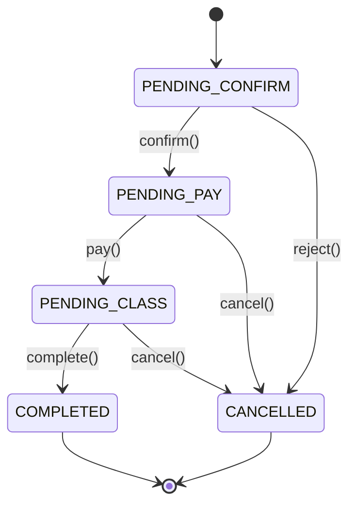

# NeoPick — Guitar Lesson Marketplace

A two-sided marketplace connecting guitar students with private teachers — search,
book, pay, review, and chat.

It demonstrates **backend engineering**: domain modeling, a booking **state machine**,
transaction management, REST APIs, WebSocket messaging, and authentication — on a
hexagonal architecture with zero framework dependencies in the domain layer.

## Core highlights

- **Booking state machine** — the booking lifecycle is modeled as explicit states and
  transitions in the domain layer, so illegal transitions are impossible at the type
  level (see below).
- **Transaction boundaries** — booking confirmation and payment are atomic units with
  clear invariants, not a pile of `UPDATE` statements.
- **Hexagonal + DDD** — `domain/` has zero framework imports (no Spring, no JPA, no
  AWS); every external concern is an adapter behind a port.
- **WebSocket chat** — real-time student↔teacher messaging with STOMP + auth.

## Booking state machine

The lifecycle is a first-class domain concept — `Booking` is an aggregate root and the
only way to change `status` is through a transition method that validates the current
state.



Every transition (`confirm`, `reject`, `pay`, `complete`, `cancel`) asserts the current
state and throws `InvalidBookingTransitionException` on an illegal move — e.g. you
cannot `pay()` a booking that is still `PENDING_CONFIRM`, and a `COMPLETED` booking
cannot be cancelled. This keeps the state valid by construction instead of scattering
`if (status == ...)` checks across services.

## Architecture

Hexagonal (Ports & Adapters) with domain-driven design:

```
adapter/          ← Spring Boot, JPA, Redis, AWS, WebSocket
application/      ← use cases (commands/results as records)
domain/           ← aggregates, value objects, domain services, ports (zero framework deps)
port/             ← outbound interfaces
infrastructure/   ← cross-cutting config (Jackson, Redis, scheduling)
shared/           ← Result monad, constants, base classes
```

## Tech stack

| Layer | Choices |
|-------|---------|
| Runtime | Java 21, Spring Boot 3.3 |
| Database | PostgreSQL 16 + Flyway migrations |
| Cache | Redis 7 |
| Auth | JWT (access + refresh) + SMS code login |
| API | REST (Spring MVC), WebSocket (STOMP chat) |
| Payments | WeChat Pay + Alipay (sandbox integration) |
| Storage | AWS S3 (presigned upload) |
| Testing | JUnit 5, Testcontainers, Rest Assured, JaCoCo |
| CI/CD | GitHub Actions, Docker multi-stage build |
| Docs | SpringDoc OpenAPI / Swagger UI |

## Quick start

Prerequisites: JDK 21+, PostgreSQL 16, Redis 7 (or Docker), Maven 3.9+.

```bash
git clone git@github.com:scoreJIm/NeoPick.git
cd NeoPick

docker run -d --name neopick-pg -p 5432:5432 \
  -e POSTGRES_DB=neopick -e POSTGRES_USER=neopick -e POSTGRES_PASSWORD=neopick_dev \
  postgres:16

docker run -d --name neopick-redis -p 6379:6379 redis:7

mvn spring-boot:run -Dspring-boot.run.profiles=dev
```

Flyway applies the schema on startup; Swagger UI at
`http://localhost:8080/swagger-ui.html`.

## Environment profiles

| Profile | DB | SMS | Redis | Purpose |
|---------|----|-----|-------|---------|
| `dev` | PostgreSQL localhost | Mock | Required | Full-stack local (default) |
| `prod` | PostgreSQL | Aliyun SMS | Redis | Production config (env-driven) |

## API overview

```
POST   /api/v1/auth/send-sms              Send login code
POST   /api/v1/auth/login                 Login / auto-register
POST   /api/v1/auth/refresh               Refresh access token

GET    /api/v1/teachers                   Search & filter teachers
GET    /api/v1/teachers/{id}              Teacher detail

POST   /api/v1/bookings                   Submit booking
GET    /api/v1/bookings/student           My bookings (student)
GET    /api/v1/bookings/teacher           My bookings (teacher)
PUT    /api/v1/bookings/{id}/confirm      Confirm booking
PUT    /api/v1/bookings/{id}/reject       Reject booking

POST   /api/v1/reviews                    Submit review
GET    /api/v1/messages/conversations     Conversation list
POST   /api/v1/messages                   Send message (also via WebSocket)
GET    /api/v1/notifications              Notification list
```

## Domain model

- **Booking** — state machine: `PENDING_CONFIRM → PENDING_PAY → PENDING_CLASS → COMPLETED` (and `CANCELLED`)
- **Teacher** — profile, level, city, instrument categories
- **Payment** — WeChat / Alipay, linked to a booking
- **Review** — 1-5 stars, one review per completed booking
- **Conversation** — real-time chat via WebSocket
- **Notification** — booking / payment / review events

## Repository layout

```
src/main/java/com/neopick/
├── domain/        ← aggregates + value objects (zero framework deps)
├── application/   ← use cases
├── adapter/       ← web, persistence, payment, sms, cache, scheduled, storage
├── port/          ← outbound interfaces
├── infrastructure/← config, metrics, rate limiting, logging
└── shared/        ← Result monad, constants

src/main/resources/
├── application*.yml
└── db/migration/   ← Flyway migrations (18 tables)
```

Deeper detail: [ARCHITECTURE.md](ARCHITECTURE.md).
